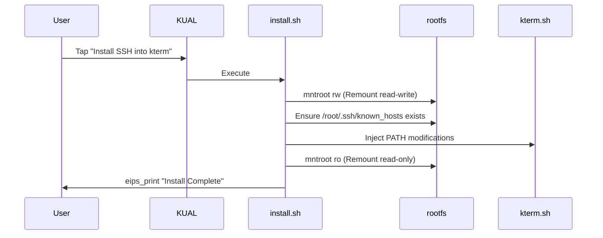
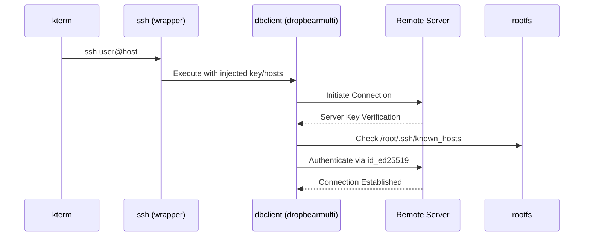
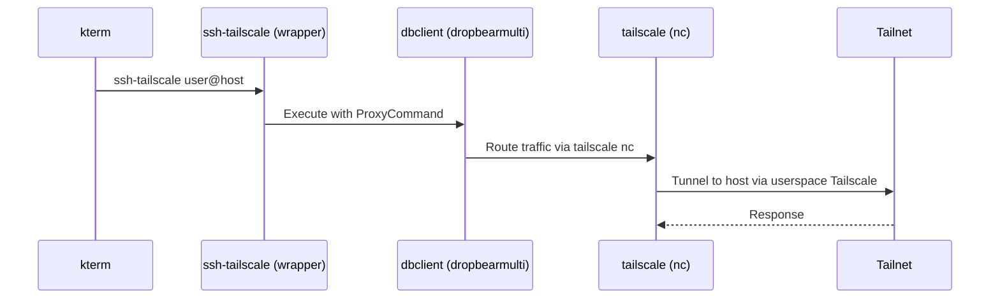

# sshk Architecture

## Project Overview
`sshk` is a KUAL (Kindle Unified Application Launcher) extension that provides a statically-compiled SSH client (`dbclient`) for jailbroken Amazon Kindle devices. Kindles do not come with an SSH client out of the box, and compiling standard OpenSSH clients dynamically on modern toolchains often results in library mismatches and segmentation faults on older Kindle kernels. `sshk` circumvents this by packaging a fully static `dropbearmulti` binary.

## Platform Constraints
The Amazon Kindle is an embedded Linux device with specific constraints that dictate the architecture of `sshk`:

*   **FAT32/VFAT Filesystem (`/mnt/us`)**: The user-accessible storage partition over USB is formatted as FAT32, which **does not support symbolic links**. This prevents the standard Dropbear mechanism of creating symlinks (e.g., `ssh -> dropbearmulti`) to invoke applets. Instead, we use shell wrapper scripts.
*   **Read-Only Rootfs**: The main filesystem (`/`) is mounted read-only by default. Modifying system files like `kterm` configuration or creating the `/root/.ssh/known_hosts` file requires temporarily remounting the filesystem as read-write using `mntroot rw` and reverting it with `mntroot ro`.
*   **No `tun.ko` Kernel Module**: The Kindle kernel typically lacks the `tun.ko` module, meaning virtual network interfaces cannot be easily created. For Tailscale support, we must use Tailscale's userspace networking mode, specifically the `tailscale nc` command acting as an SSH `ProxyCommand`.
*   **ARM Architecture**: Kindles run 32-bit ARM userland across all generations (none ship aarch64 yet). `dropbearmulti` is compiled for an **ARMv5T/v5TE soft-float baseline**, which executes on every Kindle CPU ever shipped — including post-2020 devices with hard-float-capable cores, because soft-float binaries never touch an FPU. See [SUPPORTED-DEVICES.md](SUPPORTED-DEVICES.md) for the per-device matrix. CI asserts these ELF attributes so they cannot regress.
*   **e-ink Display (`eips`)**: Outputting text to the screen directly from KUAL extensions (when not inside a terminal) requires using the `eips` command, which prints text to the framebuffer.
*   **KUAL**: The primary launcher for homebrew apps, used to invoke our setup and key management scripts via `menu.json`.
*   **kterm**: The standard terminal emulator for jailbroken Kindles. Our installation process injects the `sshk/bin` directory into `kterm`'s `PATH`.

## Directory Structure
```text
extensions/sshk/
├── bin/                        # Binaries and scripts added to PATH
│   ├── dbclient                # Wrapper script for dropbearmulti dbclient applet
│   ├── dropbearkey             # Wrapper script for dropbearmulti dropbearkey applet
│   ├── dropbearmulti           # Statically compiled multi-call binary
│   ├── genkey.sh               # KUAL script: Generates ed25519 keys
│   ├── install.sh              # KUAL script: Injects PATH and creates known_hosts
│   ├── showkey.sh              # KUAL script: Prints public key to screen
│   ├── ssh                     # Main SSH wrapper (handles key, hosts, options)
│   ├── ssh-tailscale           # Tailscale SSH wrapper (ProxyCommand via tailscale nc)
│   └── uninstall.sh            # KUAL script: Removes PATH modifications
└── menu.json                   # KUAL extension manifest
```

## Component Architecture

### `dropbearmulti`
`dropbearmulti` is the core of the project. It uses the multi-call binary pattern (similar to BusyBox), where a single binary contains the functionality of multiple tools (`dbclient`, `dropbearkey`, etc.). The behavior changes depending on the name (`$0`) used to invoke it.

### Shell Wrappers
Because the Kindle's USB partition uses FAT32 and cannot store symbolic links, we cannot simply `ln -s dropbearmulti ssh`. Instead, we create small POSIX shell scripts (`dbclient`, `dropbearkey`, `ssh`, `scp` - note: `scp` logic mentioned in prompt, assuming conceptually similar although not present in dir listing) that explicitly execute `dropbearmulti` with the correct applet argument.

### `ssh` and `ssh-tailscale` Wrappers
*   **`ssh`**: A wrapper around `dbclient` that automatically injects the path to the private key (`/mnt/us/extensions/sshk/id_ed25519`) and specifies the `known_hosts` file, providing an OpenSSH-like command-line experience.
*   **`ssh-tailscale`**: Builds upon the standard `ssh` wrapper by appending `-J` (ProxyCommand) equivalent arguments, routing the SSH connection through `tailscale nc <host> <port>`.

### Install/Uninstall Scripts
*   **`install.sh`**: Remounts the rootfs as read-write (`mntroot rw`), checks if `/root/.ssh/known_hosts` exists, creates it if necessary, symlinks it if needed, and modifies the `kterm.sh` startup script to prepend `/mnt/us/extensions/sshk/bin` to the `PATH`.
*   **`uninstall.sh`**: Reverses the changes made to `kterm.sh`.

### Key Management Scripts
Designed to be run from KUAL, these scripts use `eips` to show progress on the e-ink screen. They handle generating an `ed25519` key pair (`genkey.sh`) and displaying the public key (`showkey.sh`). To facilitate easy copying, the public key is also exported to the root of the USB drive.

### `hosts.conf`
(Note: Mentioned in prompt, serves as connection alias system if implemented).

## Data Flow Diagrams

### Installation Flow


### SSH Connection Flow


### Tailscale Connection Flow


## Security Model
*   **Key Storage**: Private keys (`id_ed25519`) are stored on the `/mnt/us` partition. Since this is accessible via USB mass storage, physical access to the unlocked Kindle grants access to the private key.
*   **Known Hosts**: To prevent Man-In-The-Middle (MITM) attacks, host keys are verified against `known_hosts`. Both `ssh` and `ssh-tailscale` run the same writable-`known_hosts` probe and only fall back to `-y` (auto-accept) when `/root/.ssh/known_hosts` cannot be created or written. The Tailscale path in particular used to force `-y` unconditionally, which was a regression: a Tailnet is the worst possible place to skip host-key verification (personal devices, often no unique usernames). Both wrappers now enforce the same posture.
*   **SCP flag handling**: `scp-tailscale` resolves host aliases from `hosts.conf` locally and threads the alias's port and named key into dropbear-scp's argv. dropbear-scp's existing forwarding logic (`-i`/`-P` -> `-i`/`-p` to its `-S` ssh program, see upstream `scp.c`) carries those flags to `ssh-tailscale`, so the SCP-over-Tailscale path uses the same key and port as a plain `ssh-tailscale` invocation would.
*   **Server authorization (`authorize-server.sh`)**: the public key is delivered to the remote host via SSH stdin and a heredoc-based script body, not interpolated into the remote command line. A key whose comment field happens to contain shell metacharacters cannot trigger arbitrary remote shell execution, because the key text is now data, not code.
*   **Menu alias lookup (`ssh-menu`)**: alias selection no longer uses `eval`. The alias list is held in a newline-separated variable and looked up with `sed -n "${n}p"`, so a `hosts.conf` line whose alias contains shell metacharacters is treated as data when the user picks it.
*   **Server PID tracking (`server-start.sh`)**: dropbear double-forks, so the immediate child of the wrapper shell is not the long-lived daemon. The wrapper now sleeps 2s, looks the daemon up via `pgrep -f "dropbear .*-p 2222"` (a token match that holds under both direct invocation and qemu-arm-static emulation), and writes the *live* PID back into PIDFILE so `server-stop.sh` and `server-toggle.sh` operate on the right process. The same pattern is used for matching; an unrelated process whose argv happens to contain `-p 2222` will not be killed.
*   **Uninstall safety (`uninstall.sh`)**: only removes `/root/.ssh` if the symlink target is the sshk-managed `.ssh` directory under `$SSHK_US_ROOT`. An unrelated symlink at that path is left alone.

## Power Management & Keepalive
Kindle firmware aggressively manages power by invoking the `powerd` daemon after 10 minutes of user inactivity, dimming the screen to a screensaver and shutting off the `wlan0` interface. To ensure long-lived SSH sessions do not drop prematurely:
*   The `ssh` and `ssh-tailscale` wrappers invoke `lipc-set-prop com.lab126.powerd preventScreenSaver 1` before connecting.
*   POSIX shell signal traps (`EXIT`, `INT`, `TERM`, `HUP`) automatically restore `preventScreenSaver 0` when the SSH session ends or disconnects, safely returning the device to standard power management.

## Inbound SSH Server Architecture
In addition to the outbound client, `sshk` includes an inbound Dropbear SSH daemon (`server-start.sh`):
*   Listens on port `2222` to avoid conflicts with system services.
*   Utilizes a persistent host key stored at `extensions/sshk/bin/kindle_host_ed25519_key`.
*   Authorizes inbound connections using public keys located in `extensions/sshk/.ssh/authorized_keys` (managed automatically via `authorize-server.sh`).

## Tailscale Integration
Because the Kindle kernel usually lacks the `tun.ko` module, standard Tailscale mesh routing does not work (Tailscale cannot create a `tailscale0` network interface). However, Tailscale can run in userspace mode. The `ssh-tailscale` wrapper leverages the `tailscale nc <host> <port>` command to pipe standard input/output through the Tailscale network, acting as an OpenSSH `ProxyCommand` to connect to internal Tailnet nodes.
