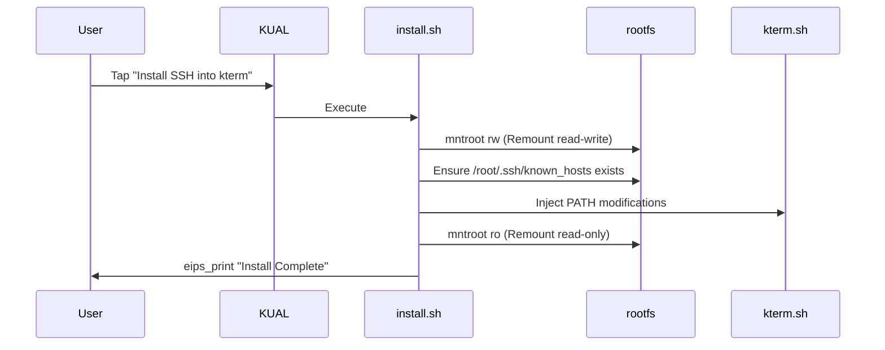
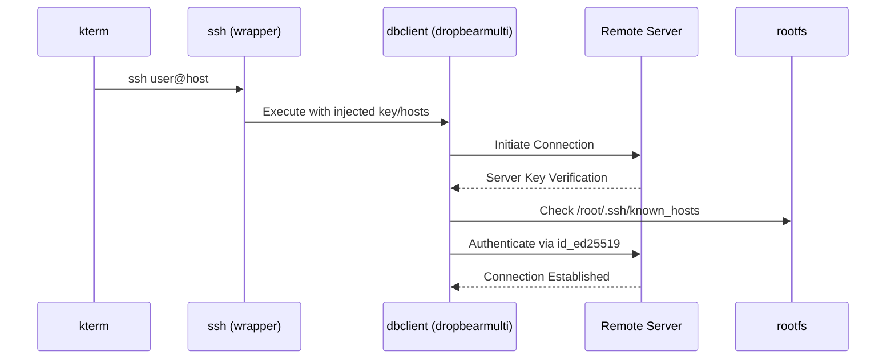
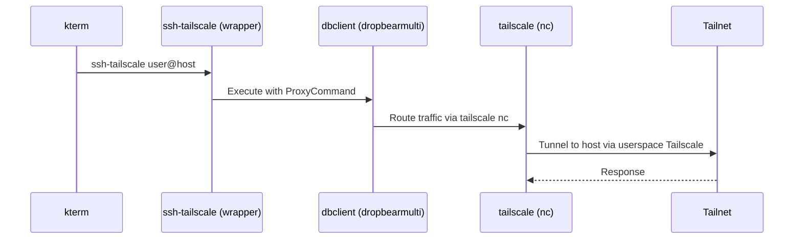

# sshk Architecture

## Project Overview
`sshk` is a KUAL (Kindle Unified Application Launcher) extension that provides a statically-compiled SSH client (`dbclient`) for jailbroken Amazon Kindle devices. Kindles do not come with an SSH client out of the box, and compiling standard OpenSSH clients dynamically on modern toolchains often results in library mismatches and segmentation faults on older Kindle kernels. `sshk` circumvents this by packaging a fully static `dropbearmulti` binary.

## Platform Constraints
The Amazon Kindle is an embedded Linux device with specific constraints that dictate the architecture of `sshk`:

*   **FAT32/VFAT Filesystem (`/mnt/us`)**: The user-accessible storage partition over USB is formatted as FAT32, which **does not support symbolic links**. This prevents the standard Dropbear mechanism of creating symlinks (e.g., `ssh -> dropbearmulti`) to invoke applets. Instead, we use shell wrapper scripts.
*   **Read-Only Rootfs**: The main filesystem (`/`) is mounted read-only by default. Modifying system files like `kterm` configuration or creating the `/root/.ssh/known_hosts` file requires temporarily remounting the filesystem as read-write using `mntroot rw` and reverting it with `mntroot ro`.
*   **No `tun.ko` Kernel Module**: The Kindle kernel typically lacks the `tun.ko` module, meaning virtual network interfaces cannot be easily created. For Tailscale support, we must use Tailscale's userspace networking mode, specifically the `tailscale nc` command acting as an SSH `ProxyCommand`.
*   **ARM Architecture**: Kindles run on older ARM processors. A statically compiled ARM binary is mandatory to ensure it works across different Kindle generations without dependency issues.
*   **e-ink Display (`eips`)**: Outputting text to the screen directly from KUAL extensions (when not inside a terminal) requires using the `eips` command, which prints text to the framebuffer.
*   **KUAL**: The primary launcher for homebrew apps, used to invoke our setup and key management scripts via `menu.json`.
*   **kterm**: The standard terminal emulator for jailbroken Kindles. Our installation process injects the `sshk/bin` directory into `kterm`'s `PATH`.

## Directory Structure
```text
extensions/sshk/
├── bin/                        # Binaries and scripts added to PATH
│   ├── dbclient                # Wrapper script for dropbearmulti dbclient applet
│   ├── dropbearkey             # Wrapper script for dropbearmulti dropbearkey applet
│   ├── dropbearmulti           # Statically compiled multi-call binary
│   ├── genkey.sh               # KUAL script: Generates ed25519 keys
│   ├── install.sh              # KUAL script: Injects PATH and creates known_hosts
│   ├── showkey.sh              # KUAL script: Prints public key to screen
│   ├── ssh                     # Main SSH wrapper (handles key, hosts, options)
│   ├── ssh-tailscale           # Tailscale SSH wrapper (ProxyCommand via tailscale nc)
│   └── uninstall.sh            # KUAL script: Removes PATH modifications
└── menu.json                   # KUAL extension manifest
```

## Component Architecture

### `dropbearmulti`
`dropbearmulti` is the core of the project. It uses the multi-call binary pattern (similar to BusyBox), where a single binary contains the functionality of multiple tools (`dbclient`, `dropbearkey`, etc.). The behavior changes depending on the name (`$0`) used to invoke it.

### Shell Wrappers
Because the Kindle's USB partition uses FAT32 and cannot store symbolic links, we cannot simply `ln -s dropbearmulti ssh`. Instead, we create small POSIX shell scripts (`dbclient`, `dropbearkey`, `ssh`, `scp` - note: `scp` logic mentioned in prompt, assuming conceptually similar although not present in dir listing) that explicitly execute `dropbearmulti` with the correct applet argument.

### `ssh` and `ssh-tailscale` Wrappers
*   **`ssh`**: A wrapper around `dbclient` that automatically injects the path to the private key (`/mnt/us/extensions/sshk/id_ed25519`) and specifies the `known_hosts` file, providing an OpenSSH-like command-line experience.
*   **`ssh-tailscale`**: Builds upon the standard `ssh` wrapper by appending `-J` (ProxyCommand) equivalent arguments, routing the SSH connection through `tailscale nc <host> <port>`.

### Install/Uninstall Scripts
*   **`install.sh`**: Remounts the rootfs as read-write (`mntroot rw`), checks if `/root/.ssh/known_hosts` exists, creates it if necessary, symlinks it if needed, and modifies the `kterm.sh` startup script to prepend `/mnt/us/extensions/sshk/bin` to the `PATH`.
*   **`uninstall.sh`**: Reverses the changes made to `kterm.sh`.

### Key Management Scripts
Designed to be run from KUAL, these scripts use `eips` to show progress on the e-ink screen. They handle generating an `ed25519` key pair (`genkey.sh`) and displaying the public key (`showkey.sh`). To facilitate easy copying, the public key is also exported to the root of the USB drive.

### `hosts.conf`
(Note: Mentioned in prompt, serves as connection alias system if implemented).

## Data Flow Diagrams

### Installation Flow


### SSH Connection Flow


### Tailscale Connection Flow


## Security Model
*   **Key Storage**: Private keys (`id_ed25519`) are stored on the `/mnt/us` partition. Since this is accessible via USB mass storage, physical access to the unlocked Kindle grants access to the private key.
*   **Known Hosts**: To prevent Man-In-The-Middle (MITM) attacks, host keys are verified against `known_hosts`. Dropbear's default strict checking is used where possible, falling back to user prompts on first connection.

## Tailscale Integration
Because the Kindle kernel usually lacks the `tun.ko` module, standard Tailscale mesh routing does not work (Tailscale cannot create a `tailscale0` network interface). However, Tailscale can run in userspace mode. The `ssh-tailscale` wrapper leverages the `tailscale nc <host> <port>` command to pipe standard input/output through the Tailscale network, acting as an OpenSSH `ProxyCommand` to connect to internal Tailnet nodes.
